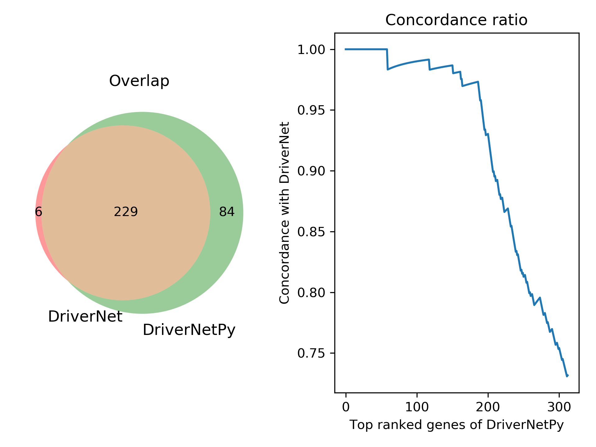

# DriverNetPy - A Python implementation of DriverNet.

This repository is a Python implementation of the [DriverNet](https://www.bioconductor.org/packages/DriverNet/) algorithm.

## Motivation

[DriverNet](https://www.bioconductor.org/packages/DriverNet/) uses an easy-to-understand greedy searching algorithm to prioritize cancer drivers. Here is the paper.

> Bashashati A, Haffari G, Ding J, Ha G, Lui K, Rosner J, Huntsman DG, Caldas C, Aparicio SA, Shah SP. 2012. DriverNet: uncovering the impact of somatic driver mutations on transcriptional networks in cancer. Genome Biology. 13:R124. doi:[10.1186/gb-2012-13-12-r124](https://doi.org/10.1186/gb-2012-13-12-r124).

I like this idea. It is elegant and effective.

To better understand it, I decided to write a Python version in case I would use this algorithm in other projects.

Also, in reading `DriverNet` paper and its R code. I found  that the R implementation of `DriverNet` has some pitfalls:

* In "finding drivers" step,  mutated gene candidates were updated by genes already covered (`line 72` in `DriverSelection.R` ). This was not mentioned in the paper. I do not know why.
* In "significance test" step, the patient-outlier matrix and patient-mutation matrix were shuffled only by gene names (`line 35-38` in `SignificanceTest.R` ), which would keep the number of outliers and mutated genes of each patient unchanged. This is different from the way described in the paper. I think the perturbation described in the paper may be more reasonable.

* In "significance test" step, the random patient-outlier matrix and random patient-mutation matrix  before running `.greedyGeneDriverSelection` were preprocessed by a different way as that used in "finding drivers". I did not know why.
* In "significance test" step, `DriverNet` does not use Benjamini-Hochberg approach to correct p-values as stated in the paper.

In addition, `DriverNetPy` extends the original R version of DriverNet by:

* using network permutation scheme as default.
* adding parallelization support to run the permutation test faster.

## Usage

### Prerequisite

`DriverNetPy` imports the following packages.

* [pandas](https://github.com/pandas-dev/pandas)
* [NetworkX](https://github.com/networkx/networkx)

### Install

```shell
git clone git@github.com:YiweiNiu/DriverNetPy.git
cd DriverNetPy
```

### Use

The program can be provoked by `DriverNet.py` script.

```shell
$ Python DriverNetPy/DriverNet.py -h
usage:

python DriverNet.py [-h] <-n network file> <-m mutation file> <-e expression outlier file> [-p permutation_time] [-t threads] [-o output prefix]

optional arguments:
  -h, --help            show this help message and exit
  -n , --network        Path to gene-gene interaction network. (default: None)
  -m , --mutation       Path to sample-mutation file. (default: None)
  -e , --expression     Path to sample-expression file. (default: None)
  -p , --permutation    Permutation times. (default: 500)
  -pg, --not-purturbGraph
                        Not permutation graphs. (default: False)
  -pd, --purturbData    Permutation data. (default: False)
  -t , --threads        Number of CPUs used when permutation. Using all CPUs
                        by default. (default: None)
  -o , --output         Output prefix. (default: DriverNetPy_res)

A Python implementation of DriverNet. See
https://github.com/YiweiNiu/DriverNetPy for details.
```

## Example

Export sample data from the `DriverNet` R package. These files can be found under the `test` folder.

```R
library(DriverNet)

data(samplePatientMutationMatrix)
data(samplePatientOutlierMatrix)
data(sampleInfluenceGraph)
data(sampleGeneNames)

# export sample data
write.table(sampleInfluenceGraph, file = 'sampleInfluenceGraph.txt', sep=',', quote = F)
write.table(samplePatientMutationMatrix, file = 'samplePatientMutationMatrix.txt', sep=',', quote = F)
write.table(samplePatientOutlierMatrix, file = 'samplePatientOutlierMatrix.txt', sep=',', quote = F)

# run DriverNet
driversList = computeDrivers(samplePatientMutationMatrix, samplePatientOutlierMatrix,
                             sampleInfluenceGraph, outputFolder=NULL, printToConsole=FALSE)
randomDriversResult = computeRandomizedResult(patMutMatrix=samplePatientMutationMatrix,
                                              patOutMatrix=samplePatientOutlierMatrix,
                                              influenceGraph=sampleInfluenceGraph,
                                              geneNameList= sampleGeneNames, outputFolder=NULL,
                                              printToConsole=FALSE, numberOfRandomTests=20,
                                              weight=FALSE, purturbGraph=FALSE, purturbData=TRUE)
res = resultSummary(driversList, randomDriversResult,
                    samplePatientMutationMatrix, sampleInfluenceGraph,
                    outputFolder=NULL, printToConsole=FALSE)
write.table(res, file='DriverNet_res.txt', quote=F, sep='\t')
```

Run `DriverNetPy` using the example data.

```shell
$ cd test
$ python ../DriverNetPy/DriverNet.py -n sampleInfluenceGraph.txt -m samplePatientMutationMatrix.txt -e samplePatientOutlierMatrix.txt
2019-05-15 16:45:13,177 - __main__ - INFO - Start running.
2019-05-15 16:45:13,177 - __main__ - INFO - Parameters: ../DriverNetPy/DriverNet.py -n sampleInfluenceGraph.txt -m samplePatientMutationMatrix.txt -e samplePatientOutlierMatrix.txt
2019-05-15 16:45:13,799 - preprocess - INFO - Reading gene-gene interacions done.
2019-05-15 16:45:15,513 - preprocess - INFO - Reading sample-gene expression outliers done.
2019-05-15 16:45:16,410 - preprocess - INFO - Reading sample-gene mutation done.
2019-05-15 16:45:16,455 - preprocess - INFO - Building bipartite graph done.
2019-05-15 16:45:17,703 - __main__ - INFO - Driver finding done. Start significance test now.
2019-05-15 16:45:17,703 - permutation - INFO - Start permutation, using 8 threads.
2019-05-15 16:50:32,328 - permutation - INFO - Permutation done.
2019-05-15 16:50:37,932 - __main__ - INFO - Significance test done.
2019-05-15 16:50:37,937 - __main__ - INFO - Writing output done. Please check DriverNet_res.txt.
2019-05-15 16:50:37,938 - __main__ - INFO - All done. Cheers.
```

Compare the result of `DriverNetPy` with `DriverNet`.

```shell
python ../script/compare.py DriverNet_res.txt DriverNetPy_res.txt
```





## Notes

### The result of DriverNetPy show discordance with that of DriverNet

This may due to:

* the reasons aforementioned in the Motivation part.
* when ranking candidate drivers, in case of a tie, randomly pick one.

### Network permutation scheme

The network permutation scheme in `DriverNetPy` considers the degree of each node in the network. The degree of each node before and after the permutation are roughly the same.

### The version of DriverNet I referred to was 1.0.0

Well, the code of DriverNet_1.0.0 (oldest) and DriverNet 1.24.0 (latest, checked in 20190515) shows no differences.

```shell
$ wget https://www.bioconductor.org/packages/2.12/bioc/src/contrib/DriverNet_1.0.0.tar.gz
$ tar zxf DriverNet_1.0.0.tar.gz; mv DriverNet DriverNet_1.0.0

$ wget https://www.bioconductor.org/packages/3.9/bioc/src/contrib/DriverNet_1.24.0.tar.gz
$ tar zxf DriverNet_1.24.0.tar.gz; mv DriverNet DriverNet_1.24.0

$ cd DriverNet_1.24.0/R
$ for sample in `ls *`; do diff $sample ../../DriverNet_1.0.0/R/${sample}; done
```

### DriverNetPy was designed based on the sample data of DriverNet

I would change the forms of input data, e.g. from raw expression data and raw mutation data.

